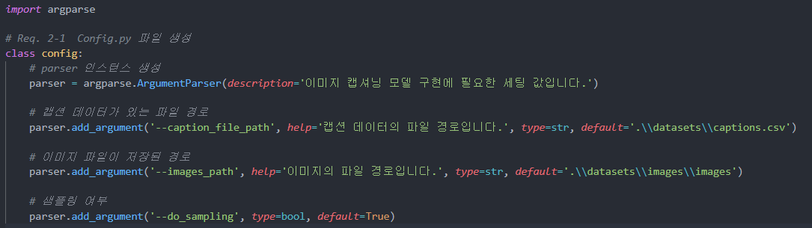

## 인공지능 맛보기 

> 기본명세 (데이터 전처리 & 시각화)는 스스로, 심화명세는 팀원 `송선민` 님이 과제를 공유해주셨습니다. 

### 01. 기본 명세

> 기본 명세는 `단순 선형 회귀 모델 구현` 과 `데이터 전처리 및 시각화 실습` 으로 이루어져있습니다.

 

##### 01-1. Req.1 

linear_regression.py 에 구현이 되어있으므로 생략합니다. 

 

##### 01-2. Req.2 

자주 변경되는 세팅값을 한 곳에서 관리하고 가져올 수 있도록 `config.py` 파일을 구현합니다.

👉 현재는 경로만 설정해주었지만, 알고리즘 구현에 필요한 다른 변수 (epoch, batch size 등) 을 지정할 때도 유용하게 사용됨을 알게되었습니다. 

👉 사용법 : `config.py` 에서 `config`  클래스를 import 합니다.  `args = config.parser.parse_args()` 로 인자들을 파싱하여 `args` 에 저장합니다. 이후, `args.인자이름` 으로 사용하고싶은 인자값을 받을 수 있습니다.

 

##### 01-3. Req.3

이미지 캡셔닝용 데이터를 전처리하는 `train.py` 와 `preprocess.py` 를 구현합니다. 

- **train.py**

👉 저장된 데이터셋을 불러올 때는 따로 입력값을 받아 해당 데이터셋을 불러올 수 있도록 했습니다.

- **preprocess.py**

👉 훈련용은 80%, 테스트용은 20%의 비율로 지정했습니다. 

👉 이미지 캡셔닝 데이터가 비슷한 데이터끼리 모여있었기 때문에 `랜덤`으로 데이터를 추출해서 데이터셋을 분리했더라면 더 객관적인 데이터셋이 되었을 것입니다.  

 

##### 01-4. Req.4

데이터를 시각화합니다. `train.py` 를 실행하면 아래와 같이 랜덤의 이미지와 캡션이 잘 나오는 것을 확인할 수 있습니다. 

 

### 02. 심화 학습

> Fashion MNIST 데이터를 학습시키는 인공신경망을 구현합니다.

👉 팀원 `송선민` 님의 코드와 설명을 통해 인공신경망의 학습예제를 이해할 수 있었습니다. 

